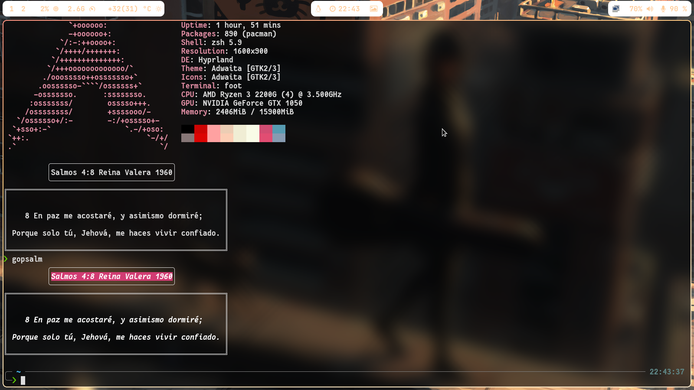

# Gopsalm


Gopsalm is a Cli program made to display random text with lipgloss(charm group) 
everytime you write gopsalm (get some colour) or you open your terminal, it has a focus on
biblical verses but you can remove them or add new ones to make it just for you

 

# Important

Before installing go psalm make sure to install git, zsh and lipgloss

zsh:
https://github.com/ohmyzsh/ohmyzsh/wiki/Installing-ZSH

lipgloss:
https://github.com/charmbracelet/lipgloss

If you have p10k go to home and then to .p10k.zsh
and make sure to put typeset -g POWERLEVEL9K_INSTANT_PROMPT
to quiet

```
  typeset -g POWERLEVEL9K_INSTANT_PROMPT=quiet
```

# Installing Gopsalm

To install GoPsalm

1.git clone the repository

```
git clone https://github.com/HanamDavid/GoPsalm.git
```
2. cd into the GoPsalm
```
cd GoPsalm
```
3.make install.sh executable with chmod +x install.sh 

```
chmod +x install.sh
```

4.make any changes to the code that you want

5.Execute install.sh, put your password when it ask you for it  
(If you want to make sure everything is fine look at the code of install.sh) 
and enjoy it!
```
./install.sh
```

# License

Copyright © 2023 <copyright holders>

Permission is hereby granted, free of charge, to any person obtaining a
copy of this software and associated documentation files (the “Software”),
to deal in the Software without restriction, including without limitation the rights to
use, copy, modify, merge, publish, distribute, sublicense, and/or sell copies of 
the Software, and to permit persons to whom the Software is furnished to do so, subject
to the following conditions:

The above copyright notice and this permission notice shall be included in all copies or substantial portions of the Software.

THE SOFTWARE IS PROVIDED “AS IS”, WITHOUT WARRANTY OF ANY KIND, EXPRESS OR IMPLIED, INCLUDING BUT NOT LIMITED 
TO THE WARRANTIES OF MERCHANTABILITY, FITNESS FOR A PARTICULAR PURPOSE AND NONINFRINGEMENT. IN NO EVENT SHALL THE AUTHORS OR 
COPYRIGHT HOLDERS BE LIABLE FOR ANY CLAIM, DAMAGES OR OTHER LIABILITY, WHETHER IN AN ACTION OF CONTRACT, TORT OR OTHERWISE, ARISING FROM, 
OUT OF OR IN CONNECTION WITH THE SOFTWARE OR THE USE OR OTHER DEALINGS IN THE SOFTWARE.

